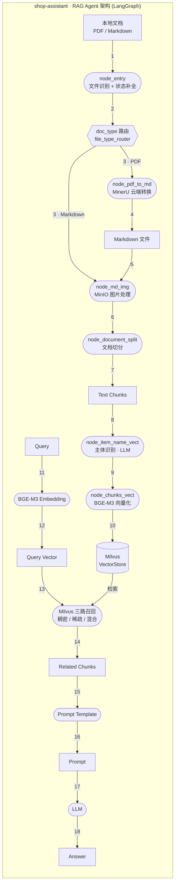

# CLAUDE.md

## 项目简介

本项目是一个标准的 RAG Agent, 旨在通过向量数据库和 LLM 的结合, 实现对文档内容的智能检索和生成答案。

项目整体架构如下：



主要包含了文档导入和查询两条链路, 分别对应 `processor/import_processor` 和 `processor/query_processor` 两个模块。

## 文档导入流程链

导入链路由 `import_processor/main_graph.py` 的 `StateGraph(ImportNodeState)` 编排, 共 7 个节点, 节点名即函数名 (`func.__name__`)。PDF 与 Markdown 两条分支在 `node_md_img` 处汇合, 之后的切分 → 识别 → 向量化 → 落库对两类文档一致:

1. **`node_entry`** — 入口节点: 读取 `task_id` / `origin_file_path`, 校验文件存在后用 `DocType.from_filename()` 识别类型; PDF 进入 `node_pdf_to_md`, Markdown 直接把 `origin_file_path` 写入 `markdown_file_path`; 文件不存在或类型未知则终止流程。✅ 已实现
2. **`node_pdf_to_md`** — PDF 转 Markdown (仅 PDF 分支): 校验 `%PDF-` 文件头后调 MinerU 云端 API (申请上传地址 → PUT 上传 → 轮询转换结果 → 下载解压 `full.md`), 写入 `markdown_file_path` / `file_title`。✅ 已实现 (依赖 `MINERU_API_KEY`)
3. **`node_md_img`** — 图片处理: 扫描 Markdown 中的图片链接, 上传 MinIO, (可选) 生成多模态描述, 替换为 MinIO URL。TODO 占位, 当前透传 state
4. **`node_document_split`** — 文档切分: 按标题层级递归切分, 过长段落二次切分, 产出带 Metadata 的 chunk 列表写入 `chunks`。TODO 占位
5. **`node_item_name_vect`** — 主体识别: 取标题等靠前内容, 调 LLM 归纳文档主体 (如 "iPhone 13"), 写入 `item_name` 供后续检索提速。TODO 占位
6. **`node_chunks_vect`** — 向量化: 加载 BGE-M3, 为每个 chunk 计算稠密向量 + 稀疏向量, 准备落库。TODO 占位
7. **`node_upsert_milvus`** — 写入向量库: 连接 Milvus, 按 `item_name` 删除旧数据, 批量插入新向量。TODO 占位

> 状态字段的「唯一事实来源」是 `import_processor/state.py` 的 `ImportNodeState`; 新增字段必须先在该 TypedDict 与 `__default_state` 中声明, 否则会被 LangGraph 静默丢弃。

## 项目结构介绍

```shell
shop-assistant/
├── docker/                 # docker 启动文件
│   └── services.yaml       # Milvus v3.0.2 standalone + etcd + MinIO + Attu + MongoDB 编排
├── docs/                   # 项目文档与笔记
│   ├── commit_message.md   # 约定式提交 (Conventional Commits) 规范
│   ├── node_log.md         # 节点日志装饰器的设计推导笔记
│   ├── setup.md            # 环境部署 (Milvus docker compose)
│   ├── poll_response.json  # MinerU 轮询响应样例
│   └── request_url_response.json  # MinerU 申请上传地址响应样例
├── dev/                    # 实验性调试脚本 (直接运行观察 src 逻辑, 不受测试保护)
│   ├── README.md           # dev 目录用途与文件清单说明
│   └── import_pdf.py       # 导入流程 (PDF 分支) 调试脚本, 走 MinerU 转换
├── src/                    # 主要源码 (即 import 根, 靠 PYTHONPATH=src 暴露)
│   ├── api/                # FastAPI 相关源码 (仅空 __init__.py, 待实现)
│   ├── common/             # 公共逻辑
│   │   ├── config/         # 各种配置类
│   │   │   └── env_config.py # pydantic-settings 配置: LogSettings / MineruSettings / Settings / ENV_CONFIG
│   │   ├── enum/           # 枚举定义
│   │   │   └── doc_type.py # DocType (PDF / MARKDOWN / UNKNOWN) + from_filename()
│   │   └── prompt/         # 提示词模板 (空, 待实现)
│   ├── processor/          # 核心 LangGraph 处理逻辑
│   │   ├── import_processor/   # 导入流程: 文档导入-切分-向量化-落库
│   │   │   ├── main_graph.py   # StateGraph 编译与接线, file_type_router 条件路由
│   │   │   ├── state.py        # ImportNodeState 状态定义 + create_state / get_default_state
│   │   │   └── nodes/          # 各节点实现 (__init__.py 为手工维护的再导出 barrel)
│   │   │       ├── node_entry.py               # 入口: 文件类型识别 + 状态补全 ✅
│   │   │       ├── node_pdf_to_md.py           # PDF 转 Markdown, 走 MinerU API ✅
│   │   │       ├── node_md_img.py              # 图片处理 (上传 MinIO + 生成描述) TODO
│   │   │       ├── node_document_split.py      # 文档切分 (标题递归切分 + Metadata) TODO
│   │   │       ├── node_item_name_vect.py # 主体识别 (LLM 归纳文档主体) TODO
│   │   │       ├── node_chunks_vect.py       # BGE-M3 稠密/稀疏向量化 TODO
│   │   │       └── node_upsert_milvus.py       # 写入向量库 (删旧 + 批量插) TODO
│   │   └── query_processor/    # 查询流程: query-向量化-三路召回-生成答案 (空, 待实现)
│   ├── utils/              # 工具逻辑
│   │   ├── logging_utils.py # loguru 日志初始化 + 调用位置修正 (file:line:function)
│   │   ├── node_utils.py    # trace_node / node_log / step_log 装饰器
│   │   ├── path_utils.py    # get_project_root / from_project_root / get_path_dir
│   │   └── task_utils.py    # 4 个进程内任务状态字典 (running/done/status/result) + SSE 占位
│   └── web/                # 最终 Web 呈现 (仅 .gitkeep, 待实现)
├── test/                   # pytest 测试目录
│   ├── conftest.py         # 全局 fixture (project_root / sample_md / sample_pdf ...) + 三档 marker 的 --run-unit/--run-smoke/--run-integration 开关
│   ├── unit/               # 单元测试, 与 src 目录一一镜像 (默认运行)
│   │   ├── conftest.py     # autouse 的 clean_task_store, 隔离 task_utils 全局字典
│   │   ├── api/ web/       # 占位 (仅 .gitkeep)
│   │   ├── common/         # config/env_config_test.py, enum/doc_type_test.py, prompt/ (占位)
│   │   ├── processor/      # import_processor/ (main_graph_test.py, state_test.py, nodes/ 7 个)
│   │   │                   # query_processor/ (占位)
│   │   └── utils/          # logging / node / path / task_utils_test.py
│   ├── smoke/              # 冒烟测试, 真实 apikey / 网络请求 (默认跳过, --run-smoke 开启)
│   │   ├── conftest.py     # clean_task_store + pytest_runtest_call 用例横幅分隔
│   │   └── import_flow_test.py  # 导入链路冒烟 (md 直通 / pdf 走 MinerU)
│   ├── integration/        # 集成测试, 模块耦合 (默认跳过, --run-integration 开启; 目前仅 .gitkeep)
│   ├── experimental/       # 试验性脚本, 仅供参考
│   │   └── colorful_print_test.py  # ANSI 彩色打印实验
│   └── test-data/          # 测试样例文件
│       ├── entropy.pdf             # PDF 样例
│       ├── hak180产品安全手册.pdf    # PDF 样例 (MinerU 转换自测用)
│       ├── 第一章-初识智能体.md      # Markdown 样例
│       └── test.txt                # 不支持的类型, 用于负向用例
├── pyproject.toml          # 依赖声明 + pytest / coverage 配置
├── uv.lock                 # uv 锁文件
├── .env / .env.sample      # 环境变量 (真实 .env 不入库, 只提交 sample)
├── .python-version         # 3.12
└── README.md
```
